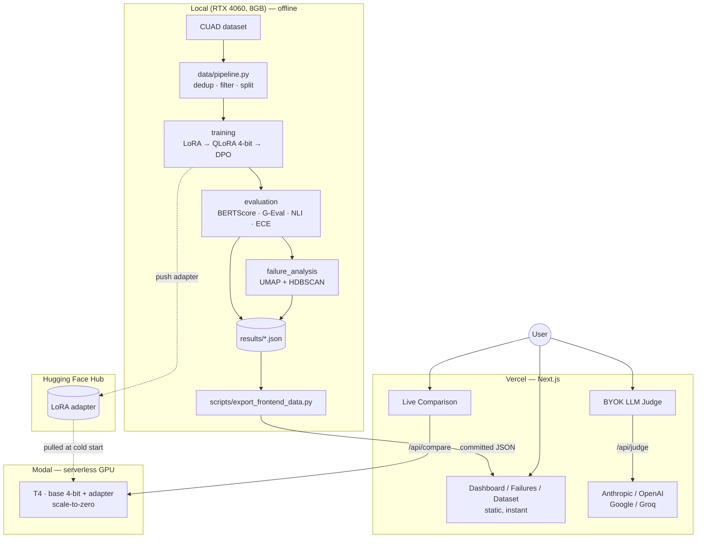

# Fine-Tuned Domain LLM — Legal Clause Extraction with QLoRA + DPO

> Llama 3.2 3B fine-tuned to extract clauses from legal contracts, evaluated the way production teams actually evaluate models — and served end to end.

[](https://github.com/shiva-shivanibokka/Fine-Tuned-Domain-LLM-QLoRA/actions/workflows/ci.yml)
[](LICENSE)


**🔗 Live demo: [cuad-legal-llm.vercel.app](https://cuad-legal-llm.vercel.app)** — all four views are live: the interactive base-vs-fine-tuned comparison runs on a serverless GPU (Modal), and the ablation dashboard, failure explorer, and dataset views serve committed evaluation snapshots.

---

## Recruiter TL;DR

- **What it does:** fine-tunes Llama 3.2 3B to extract specific clauses (Governing Law, Termination, IP Ownership, …) from real commercial contracts, with a full evaluation harness and a live comparison UI.
- **Hardest problem solved:** running the entire train → evaluate → serve loop on an **8 GB laptop GPU** — 4-bit QLoRA to fit the model in VRAM, plus an evaluation suite (BERTScore, hallucination-via-NLI, calibration/ECE, failure clustering) that measures *trustworthiness*, not just token overlap.
- **Honest headline result:** fine-tuning **cut hallucination ~4%** and **improved calibration ECE by ~8.5%** (0.679 → 0.621) over the base model — while revealing that BERTScore alone would have *missed* that gain. A nuanced, real finding rather than a single cherry-picked number.

---

## Overview

Contract review is slow, expensive, and exactly the kind of narrow, high-stakes task where a small fine-tuned model can be more useful than a giant general one — *if* you can trust its outputs. This project takes a domain LLM from raw data all the way to a served, comparable demo, and treats evaluation as a first-class concern:

- **Domain:** legal clause extraction on **CUAD** (Contract Understanding Atticus Dataset — 510 attorney-annotated contracts).
- **Technique:** parameter-efficient fine-tuning with **QLoRA (4-bit)** followed by **DPO** preference optimization — the modern alternative to RLHF.
- **Evaluation:** BERTScore, LLM-as-judge (G-Eval), NLI-based hallucination rate, **Expected Calibration Error (ECE)**, and UMAP + HDBSCAN failure-mode clustering.
- **Serving:** a **Modal** serverless-GPU backend (T4, scales to zero — no idle cost) that runs the base and fine-tuned models side by side, behind a **Next.js** dashboard on Vercel.

It is built and documented as a portfolio piece: the interesting parts are the engineering tradeoffs and the honest, multi-metric evaluation — not an inflated accuracy number. The live comparison even shows this honesty in action: on many inputs the fine-tuned model over-generates, the exact hallucination the failure-analysis harness quantifies.

---

## Results

Fine-tuned on an **8 GB RTX 4060 laptop** (4-bit to fit VRAM), **3 epochs**, ~886 training examples. Evaluated on a fixed 120-sample held-out test set. Lower is better for Hallucination and ECE.

| Metric | Base (Llama 3.2 3B) | QLoRA (4-bit) | QLoRA + DPO |
|---|---|---|---|
| **BERTScore F1** | 0.490 | 0.473 | 0.469 |
| **Clause presence accuracy** | 0.983 | 0.983 | 0.983 |
| **Hallucination rate ↓** | 0.845 | **0.818** | **0.815** |
| **ECE (calibration) ↓** | 0.679 | **0.622** | **0.621** |
| **Training VRAM** | — | **3.9 GB** | 4.1 GB |

### Reading the results honestly

The headline is *not* "fine-tuned model beats base on everything." It's more interesting than that:

- **Fine-tuning improved trustworthiness, not phrasing overlap.** The fine-tuned models reduced hallucination (0.845 → 0.815) and delivered the largest gain in **calibration** — ECE dropped from 0.679 to 0.621 (~8.5% better). In a legal setting, a model that *knows when it's unsure* matters more than one that paraphrases the reference slightly closer.
- **BERTScore did not improve** (0.490 → 0.473). The base instruction-tuned model is already fluent at the extraction wording, and its slightly more verbose answers score marginally higher on embedding-overlap BERTScore. Relying on BERTScore alone would have hidden the real, useful improvement in calibration and grounding — which is exactly why the harness measures five things, not one.
- **DPO ≈ QLoRA here.** DPO ran and produced a checkpoint, but its `rewards/margins` stayed flat on the 114 auto-generated preference pairs (a known interaction between a reference-free setup and a PEFT policy loaded from a checkpoint). The pipeline and technique are implemented correctly; the preference signal simply didn't move at this data scale. This is documented rather than hidden.

**Reproduce it:** `python -m scripts.run_all` runs the whole pipeline; per-model results land in `results/*.json` and feed the dashboard.

---

## Features

- **Three-stage fine-tuning** — LoRA / QLoRA 4-bit / DPO, each a separate, configurable run sharing one training core.
- **Data quality pipeline** — CUAD → per-clause MinHash-LSH deduplication → percentile perplexity filtering → chat-template formatting → stratified split → dataset card.
- **Five-metric evaluation** — BERTScore F1, G-Eval (LLM-as-judge), NLI hallucination rate, clause-presence accuracy, and ECE with reliability bins.
- **Failure-mode analysis** — embeds failing predictions, projects with UMAP, clusters with HDBSCAN, and auto-labels each cluster by clause type + error pattern.
- **Serverless-GPU inference** — a Modal app (T4, scale-to-zero) with a memory-efficient single-model design (one 4-bit base, LoRA adapter toggled via PEFT), HF weights cached in a Modal Volume for fast cold starts. A standalone FastAPI app (`serving/api.py`) mirrors it for local use.
- **Next.js dashboard** — 4 views (live comparison, ablation dashboard, failure explorer, dataset), plus a **bring-your-own-key LLM judge** supporting Anthropic, OpenAI, Google, and Groq.
- **Reproducible** — one-command orchestrator, pinned dependencies, unit tests, and CI.

---

## Architecture

Training happens once, locally, on the GPU. Serving is split so the demo is fast *and* free: three of the four dashboard tabs read committed JSON snapshots (instant, no backend), and only live inference calls the model.



**Why this shape?** The base weights (~6.4 GB in bf16) dominate memory, so training uses 4-bit quantization to fit an 8 GB card, and the inference backend loads the base **once** and toggles the LoRA adapter rather than holding multiple full copies. Modal's scale-to-zero means the GPU costs nothing while idle and only spins up on a real request. On the frontend, baking evaluation results into static JSON means three tabs cost nothing to serve and never wait on a cold GPU — only the "Compare" action pays that latency. One subtle but critical serving detail: inference must rebuild the **exact** training prompt (a clean Llama-3.2 chat template), because `tokenizer.apply_chat_template` injects a date preamble that makes the tuned adapter degenerate — a good example of train/serve skew.

---

## Tech Stack

| Layer | Choice | Why |
|---|---|---|
| Base model | `meta-llama/Llama-3.2-3B-Instruct` | Largest model that fits full training headroom on 8 GB |
| Fine-tuning | PEFT, bitsandbytes (4-bit NF4), TRL (`SFTTrainer`, `DPOTrainer`) | Standard modern QLoRA + DPO stack |
| Data quality | `datasketch` (MinHash LSH), unigram perplexity | Scales to large corpora; no GPU needed |
| Evaluation | `bert-score`, `sentence-transformers` (NLI), `anthropic`/`openai` (G-Eval) | Semantic + faithfulness + calibration, not n-gram overlap |
| Failure analysis | `umap-learn`, `hdbscan` | Finds arbitrary-shaped clusters without pre-specifying `k` |
| Tracking | MLflow | Per-run params/metrics/artifacts |
| Serving | Modal serverless GPU (T4, scale-to-zero) | On-demand GPU with no idle cost — effectively free within the monthly credit |
| Frontend | Next.js 16 (App Router) on Vercel | Server route handlers proxy the Modal endpoint + hide keys |
| Tooling | pytest, ruff, GitHub Actions | Tests + lint in CI |

---

## Skills Demonstrated

- **Production ML deployment / MLOps** — training, evaluation, and a separate serving API with lazy model loading and health checks.
- **LLM application development** — QLoRA + DPO fine-tuning, a multi-provider LLM-as-judge, chat-template handling, quantized inference.
- **Data engineering / ETL** — a raw→processed pipeline with deduplication, filtering, and stratified splitting.
- **Model evaluation & calibration** — BERTScore, NLI-grounded hallucination scoring, and Expected Calibration Error with reliability bins.
- **RESTful API design** — FastAPI (`/generate`, `/compare`, `/models`, `/health`) and Next.js route handlers (`/api/compare`, `/api/judge`).
- **System design & architecture** — documented tradeoffs (4-bit to fit VRAM, single-model adapter toggling, static-vs-dynamic frontend split).
- **CI/CD & testing** — GitHub Actions running ruff + pytest on every push.
- **Full-stack development** — Python ML backend + TypeScript/React frontend, wired together with a secure key-proxying layer.

---

## Getting Started

### Prerequisites
- Python 3.11+, and a CUDA GPU for training (tested on an RTX 4060 8 GB). Evaluation and serving also run on CPU, more slowly.
- A Hugging Face account with accepted access to `meta-llama/Llama-3.2-3B-Instruct` (gated), authenticated via `huggingface-cli login`.

### Install
```bash
git clone https://github.com/shiva-shivanibokka/Fine-Tuned-Domain-LLM-QLoRA
cd Fine-Tuned-Domain-LLM-QLoRA
pip install -r requirements.txt          # install torch with your CUDA build first (see requirements.txt)
cp .env.example .env                      # optional: HF_REPO_ID, ANTHROPIC/GROQ keys for G-Eval
```

### Run the full pipeline (one command)
```bash
python -m scripts.run_all                 # data → train (LoRA/QLoRA/DPO) → eval → failures → export
```

Or stage by stage:
```bash
python -m data.pipeline
python -m training.train_qlora
python -m training.train_dpo
python -m evaluation.evaluator --model qlora
python -m evaluation.failure_analysis --model dpo
python -m scripts.export_frontend_data
```

### Frontend
```bash
cd frontend
npm install
cp .env.local.example .env.local          # set MODAL_COMPARE_URL to your Modal endpoint
npm run dev                                # http://localhost:3000
```

---

## Usage

Serve the model locally and compare base vs. fine-tuned:
```bash
uvicorn serving.api:app --port 8000
```
```bash
curl -X POST http://localhost:8000/compare \
  -H "Content-Type: application/json" \
  -d '{"contract_text":"This Agreement shall be governed by the laws of the State of Delaware...","clause_type":"Governing Law"}'
```
```json
{
  "clause_type": "Governing Law",
  "base_output": "...",
  "finetuned_output": "...",
  "latency_base_ms": 812,
  "latency_finetuned_ms": 796
}
```

---

## Project Structure

```
├── config.py                 All hyperparameters, paths, and model IDs
├── data/pipeline.py          CUAD → dedup → filter → format → split → dataset card
├── training/
│   ├── train_lora.py         Shared training core (SFT with PEFT + MLflow)
│   ├── train_qlora.py        4-bit NF4 QLoRA run
│   └── train_dpo.py          DPO preference optimization on the QLoRA adapter
├── evaluation/
│   ├── evaluator.py          5-metric evaluation harness
│   └── failure_analysis.py   UMAP + HDBSCAN failure clustering
├── serving/
│   ├── modal_app.py          Modal serverless-GPU backend (T4, scale-to-zero) — the live one
│   └── api.py                Standalone FastAPI inference API (single-model adapter toggling) for local use
├── space/                    Legacy Hugging Face Space (Gradio SDK + ZeroGPU) — kept as a fallback
├── frontend/                 Next.js 16 dashboard + BYOK LLM judge (deploys to Vercel)
├── scripts/
│   ├── run_all.py            One-command pipeline orchestrator
│   └── export_frontend_data.py   results/*.json → frontend/data/*.json
├── tests/                    pytest unit tests (torch-free, run in CI)
└── .github/workflows/ci.yml  ruff + pytest
```

---

## Testing

```bash
pytest tests/ -q
ruff check .
```
Unit tests cover the data-pipeline logic most prone to silent breakage (per-clause deduplication, percentile perplexity filtering, stratified splitting, clause-type mapping). They are deliberately torch-free so CI stays fast; they run on every push via GitHub Actions. Coverage is focused rather than exhaustive — the training/serving paths are validated by end-to-end runs, not unit tests.

---

## Deployment

- **Frontend — live on Vercel:** [cuad-legal-llm.vercel.app](https://cuad-legal-llm.vercel.app), connected to this GitHub repo (root directory `frontend`), so pushes to `main` auto-deploy. The dashboard, failure explorer, and dataset tabs serve committed result snapshots and work with no backend.
- **Trained adapter — on the Hub:** [`shiva-1993/llama-3.2-3b-cuad-dpo`](https://huggingface.co/shiva-1993/llama-3.2-3b-cuad-dpo).
- **Inference backend — live on Modal (`serving/modal_app.py`):** a serverless-GPU app that loads the 4-bit base + LoRA adapter on a T4 and exposes a `/compare` endpoint the frontend proxies. It **scales to zero**, so it costs nothing while idle and stays within Modal's free monthly credit. Deploy with `modal deploy serving/modal_app.py` (after `modal token new` and a `huggingface` secret holding `HF_TOKEN`), then set `MODAL_COMPARE_URL` on Vercel to the printed endpoint. First request after idle pays a ~20–40 s cold start; subsequent calls take a few seconds. The legacy Gradio Space in `space/` remains as an alternative backend.

---

## Roadmap / Known Limitations

- **BERTScore did not improve over base** — the fine-tuned model's gains are in calibration and hallucination. Adding a reference-flexible metric (or exact-span F1) would characterize extraction quality better than embedding overlap alone.
- **DPO produced no measurable preference signal** on 114 auto-generated pairs. Next step: a larger, human-or-heuristic-verified preference set, and switching to an explicit reference model for cleaner reward margins.
- **Evaluation runs on a 120-sample subset** for tractable runtime on a laptop GPU; the full test set would tighten the confidence intervals.
- **G-Eval (LLM-as-judge)** is optional and skipped without an API key; the four intrinsic metrics run without one.

---

## License

MIT — see [LICENSE](LICENSE).
